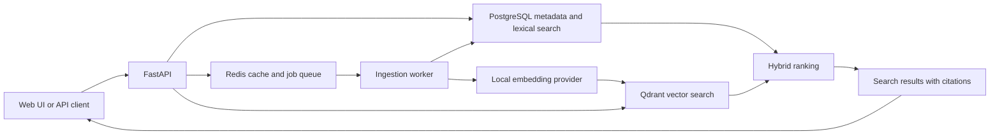

# Enterprise Knowledge Search

Enterprise Knowledge Search is a document retrieval and question-answering service for
technical and operational knowledge. The project focuses on traceable search results,
explicit retrieval behaviour, and local development without paid service credentials.

## Problem

Useful information is often distributed across PDF, Markdown, and text files. Basic keyword
search misses related terminology, while ungrounded generated answers make it difficult to
verify a result. This service is designed to combine lexical and semantic retrieval and return
citations that identify the supporting document section.

## Current status

The repository currently contains the approved architecture and a runnable FastAPI foundation.
It exposes liveness and readiness endpoints with typed configuration. Document ingestion,
retrieval, and the user interface will be added as tested vertical slices.

## Planned architecture



PostgreSQL will remain the source of truth. Qdrant will store dense vectors referenced by
stable chunk identifiers. Reciprocal-rank fusion will combine lexical and vector result lists
without treating their raw scores as directly comparable.

## Local setup

Prerequisites:

- Python 3.13
- [uv](https://docs.astral.sh/uv/)
- GNU Make

Install dependencies and create local configuration:

```bash
make sync
cp .env.example .env
```

Run all foundation checks:

```bash
make check
```

Start the API:

```bash
make run
```

The interactive API documentation is available at `http://127.0.0.1:8000/docs`.

## Example requests

Liveness:

```bash
curl http://127.0.0.1:8000/health/live
```

Expected response:

```json
{"status":"ok"}
```

Readiness:

```bash
curl http://127.0.0.1:8000/health/ready
```

Expected response:

```json
{"status":"ready"}
```

## Technology and design decisions

- FastAPI and Pydantic provide typed HTTP and configuration boundaries.
- PostgreSQL will provide transactional metadata storage and full-text retrieval.
- Qdrant will provide dense-vector retrieval.
- Redis will support background ingestion and revision-aware caching.
- Answer generation will be optional and disabled by default.
- The web interface will use server-rendered HTML and small local JavaScript modules.

The detailed design is in [docs/architecture.md](docs/architecture.md), with trade-offs in
[docs/design-decisions.md](docs/design-decisions.md).

## Limitations

The current foundation does not ingest or search documents. The first implementation will
support text-based PDFs only, use an English-focused local embedding model, store uploaded
files locally, and operate as a single workspace without authentication.

## Roadmap

The short project roadmap is maintained in [ROADMAP.md](ROADMAP.md). Work proceeds through
ingestion, retrieval, grounded answers, interface development, evaluation, and operational
verification.

## Licence

Licensed under the Apache License 2.0. See [LICENSE](LICENSE).
