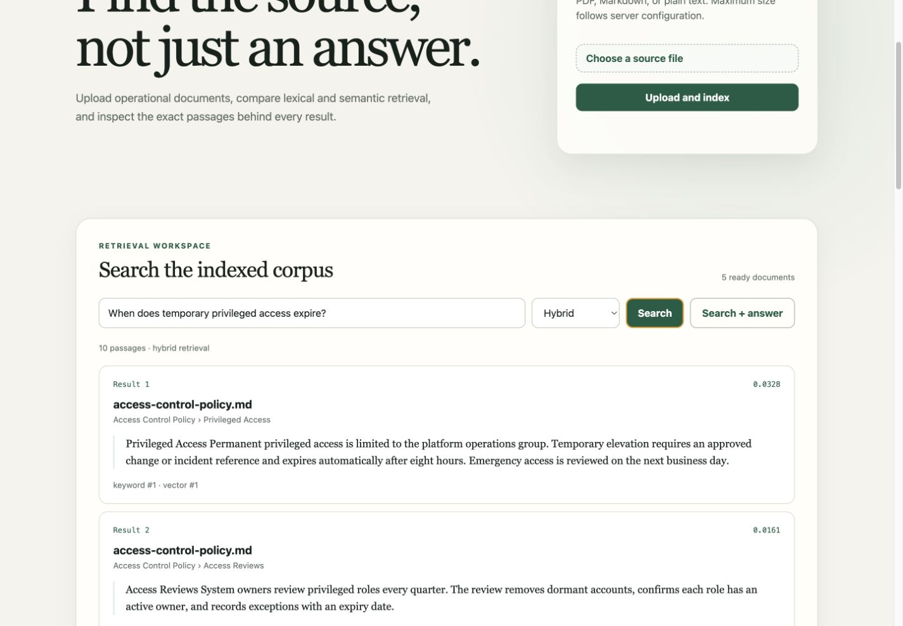
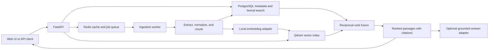

# Enterprise Knowledge Search

Enterprise Knowledge Search is a local-first document retrieval and question-answering
service for technical and operational knowledge. It combines PostgreSQL full-text search with
Qdrant vector search, returns section- and page-aware citations, and remains useful when answer
generation is disabled.



The same interface also has a verified
[mobile layout](docs/images/mobile-layout.jpg) without a separate front-end build.

## Problem

Operational knowledge often lives across PDF, Markdown, and text files. Exact keyword search
misses related terminology, while an answer without its evidence is difficult to trust. This
service treats retrieval and citations as the core product: users can compare lexical,
semantic, and hybrid results and inspect the passage behind each result.

## Features

- Validated PDF, Markdown, and text uploads with streamed storage and duplicate detection
- Background extraction, normalization, configurable chunking, embedding, and indexing
- PostgreSQL metadata and full-text search, Qdrant vector search, and reciprocal-rank fusion
- Citations containing the source file, heading path, page number, and stable chunk identifier
- Revision-aware Redis caching and recoverable document deletion
- No-generation search mode plus an optional configurable answer-provider interface
- Structured JSON logs, request IDs, Prometheus metrics, liveness, and dependency readiness
- Browser interface, OpenAPI documentation, database migrations, and original demonstration data
- Reproducible Recall@k, MRR, and NDCG evaluation

## Architecture



PostgreSQL is authoritative for document state and chunk metadata. Qdrant is a derived index
addressed with deterministic chunk identifiers. The ingestion, retrieval, ranking, and answer
generation modules have separate responsibilities; external providers are behind narrow ports.
See [docs/architecture.md](docs/architecture.md) for the detailed flow.

## Local setup

Prerequisites:

- Docker with Compose
- Python 3.13
- [uv](https://docs.astral.sh/uv/)
- GNU Make

Create local configuration and replace the example PostgreSQL password:

```bash
cp .env.example .env
make sync
```

Start the complete environment and load the five project-authored sample documents:

```bash
make compose-up
make seed
make smoke
```

The first semantic ingestion downloads the configured embedding model into a persistent local
volume. No paid credentials are required. The main endpoints are:

- Interface: `http://127.0.0.1:8000`
- OpenAPI: `http://127.0.0.1:8000/docs`
- Readiness: `http://127.0.0.1:8000/health/ready`
- Metrics: `http://127.0.0.1:8000/metrics`

Stop the services without removing their data:

```bash
make compose-down
```

For native development, update both `POSTGRES_PASSWORD` and the password inside
`EKS_DATABASE_URL`, start PostgreSQL, Redis, and Qdrant, then run `make migrate`, `make worker`,
and `make run`.

## Example API requests

Check readiness:

```bash
curl http://127.0.0.1:8000/health/ready
```

Expected response:

```json
{
  "status": "ready",
  "checks": {
    "database": true,
    "queue": true,
    "vector_index": true
  }
}
```

Upload a Markdown document:

```bash
curl --request POST \
  --url http://127.0.0.1:8000/api/v1/documents \
  --form 'document=@docs/requirements.md;type=text/markdown'
```

The API returns `202 Accepted` with a queued document and ingestion job:

```json
{
  "document": {
    "id": "927de0ef-4454-4742-91d5-d8d46d5b604a",
    "original_filename": "requirements.md",
    "status": "queued"
  },
  "ingestion_job": {
    "id": "30cf997a-9818-449b-bf72-d745fc62252e",
    "status": "queued",
    "attempt_count": 0
  }
}
```

Search the ready corpus:

```bash
curl --get \
  --url http://127.0.0.1:8000/api/v1/search \
  --data-urlencode 'q=When does temporary privileged access expire?' \
  --data 'mode=hybrid' \
  --data 'limit=1'
```

A result includes its retrieval contributions and citation:

```json
{
  "query": "When does temporary privileged access expire?",
  "mode": "hybrid",
  "items": [
    {
      "score": 0.03278688524590164,
      "keyword_rank": 1,
      "vector_rank": 1,
      "media_type": "text/markdown",
      "citation": {
        "original_filename": "access-control-policy.md",
        "section_path": ["Access Control Policy", "Privileged Access"],
        "page_number": null,
        "excerpt": "Temporary elevation ... expires automatically after eight hours."
      }
    }
  ]
}
```

Use `mode=keyword` to search without embedding the query. `mode=vector` uses semantic search
only. `mode=hybrid` fuses both ranked candidate lists.

Ask for an answer while generation is disabled:

```bash
curl --request POST \
  --url http://127.0.0.1:8000/api/v1/answers \
  --header 'Content-Type: application/json' \
  --data '{"question":"How long are backups retained?","mode":"hybrid","limit":5}'
```

The response has `generation_status: "disabled"`, a null answer, and the retrieved sources.
Set `EKS_ANSWER_PROVIDER=chat_http` to use a compatible local or explicitly configured remote
service. Search continues to work if that provider is unavailable.

## Evaluation

The repository contains five original documents and eight graded queries. Run:

```bash
MODE=hybrid LIMIT=5 make evaluate
```

The command evaluates live API responses with Recall@5, MRR, and NDCG@5. The measured local
results and their boundaries are recorded in
[docs/evaluation-results.md](docs/evaluation-results.md); they are a regression diagnostic for
this small corpus, not a deployment benchmark.

## Technology and design decisions

- FastAPI and Pydantic define typed HTTP and configuration boundaries.
- PostgreSQL provides transactions, lifecycle state, citation metadata, and lexical retrieval.
- Qdrant provides dense-vector retrieval; Redis provides the queue and revision-aware cache.
- FastEmbed runs the default English BGE model locally through ONNX.
- RQ keeps the background workflow small while supporting retries and scheduled retry handling.
- Jinja, local CSS, and small JavaScript modules avoid a separate front-end toolchain.
- Multi-stage, non-root, read-only images minimize runtime contents and permissions.

Trade-offs are recorded in [docs/design-decisions.md](docs/design-decisions.md). Resolved
dependencies and licence considerations are in [docs/dependencies.md](docs/dependencies.md).

## Quality checks

```bash
make format
make check
make audit
make container-build
make container-scan
make secret-scan
```

Integration tests use isolated PostgreSQL and Redis containers. Container scan observations,
including the remaining upstream Qdrant findings, are documented in
[docs/verification.md](docs/verification.md).

## Limitations

- Text-based PDFs are supported; scanned documents require OCR before upload.
- The default embedding model is English-focused and the evaluation corpus is intentionally small.
- Uploaded files use a local volume rather than object storage.
- The service is a single workspace without authentication, authorization, quotas, or rate limits.
- Reconciliation is idempotent at job boundaries but there is no distributed transaction between
  PostgreSQL and Qdrant.
- Optional answers depend on the quality and availability of the configured provider.
- The system has not been load-tested and makes no throughput or scale claim.

## Future improvements

- Add OCR and table-aware extraction with citation-preserving page coordinates.
- Add tenant-aware authorization, rate limiting, and object-storage isolation.
- Expand relevance judgments and compare reranking strategies on multilingual corpora.

The shorter delivery roadmap is in [ROADMAP.md](ROADMAP.md).

## Licence

Licensed under the Apache License 2.0. See [LICENSE](LICENSE).
