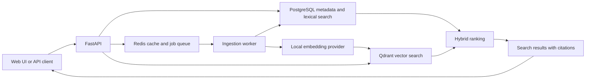

# Enterprise Knowledge Search

Enterprise Knowledge Search is a document retrieval and question-answering service for
technical and operational knowledge. The project focuses on traceable search results,
explicit retrieval behaviour, and local development without paid service credentials.

## Problem

Useful information is often distributed across PDF, Markdown, and text files. Basic keyword
search misses related terminology, while ungrounded generated answers make it difficult to
verify a result. This service is designed to combine lexical and semantic retrieval and return
citations that identify the supporting document section.

## Current status

The current implementation accepts validated PDF, Markdown, and text uploads, rejects duplicate
content, and queues ingestion through Redis. A worker extracts and normalizes content, applies
the configured chunking strategy, generates local embeddings, writes vectors to Qdrant, and
stores citation metadata and lexical-search vectors in PostgreSQL. Document and job status
endpoints expose each lifecycle transition. Keyword, vector, and hybrid search return source
citations. A disabled-by-default answer endpoint can call a configured chat-completions HTTP
service while preserving the underlying sources. Search responses are cached in Redis against
the current corpus revision, and the API exposes structured request logs, correlation IDs, and
Prometheus metrics. Recoverable deletion removes vectors, stored files, and relational
metadata. A server-rendered browser interface covers upload, status polling, search, optional
answers, source inspection, and deletion without a separate front-end build.

## Architecture



PostgreSQL will remain the source of truth. Qdrant will store dense vectors referenced by
stable chunk identifiers. Reciprocal-rank fusion will combine lexical and vector result lists
without treating their raw scores as directly comparable.

## Local setup

Prerequisites:

- Python 3.13
- [uv](https://docs.astral.sh/uv/)
- GNU Make
- Docker or another Testcontainers-compatible runtime

Install dependencies and create local configuration:

```bash
make sync
cp .env.example .env
```

Run all foundation checks:

```bash
make check
```

`make check` includes integration tests that start isolated PostgreSQL and Redis containers.
Use `make test-unit` when a container runtime is unavailable.

Start the API:

```bash
make run
```

Start the ingestion worker in another terminal:

```bash
make worker
```

The interactive API documentation is available at `http://127.0.0.1:8000/docs`.

Apply migrations to the PostgreSQL instance configured by `EKS_DATABASE_URL`:

```bash
make migrate
make migration-check
```

## Example requests

Liveness:

```bash
curl http://127.0.0.1:8000/health/live
```

Expected response:

```json
{"status":"ok"}
```

Readiness:

```bash
curl http://127.0.0.1:8000/health/ready
```

Expected response:

```json
{
  "status": "ready",
  "checks": {
    "database": true,
    "queue": true,
    "vector_index": true
  }
}
```

Upload a Markdown document:

```bash
curl --request POST \
  --url http://127.0.0.1:8000/api/v1/documents \
  --form 'document=@docs/requirements.md;type=text/markdown'
```

The API returns `202 Accepted` with the queued document and ingestion-job identifiers:

```json
{
  "document": {
    "id": "927de0ef-4454-4742-91d5-d8d46d5b604a",
    "original_filename": "requirements.md",
    "media_type": "text/markdown",
    "size_bytes": 3186,
    "status": "queued",
    "failure_code": null,
    "created_at": "2026-07-30T16:00:00Z",
    "updated_at": "2026-07-30T16:00:00Z"
  },
  "ingestion_job": {
    "id": "30cf997a-9818-449b-bf72-d745fc62252e",
    "document_id": "927de0ef-4454-4742-91d5-d8d46d5b604a",
    "status": "queued",
    "attempt_count": 0,
    "failure_code": null,
    "created_at": "2026-07-30T16:00:00Z",
    "updated_at": "2026-07-30T16:00:00Z",
    "started_at": null,
    "finished_at": null
  }
}
```

Search the ready corpus with reciprocal-rank fusion:

```bash
curl --get \
  --url http://127.0.0.1:8000/api/v1/search \
  --data-urlencode 'q=How long are backups retained?' \
  --data 'mode=hybrid' \
  --data 'limit=5'
```

Use `mode=keyword` to search without loading the embedding model. Results contain the source
document, chunk, section path, page number when available, and the ranks contributed by each
retriever.

Ask a question while generation is disabled:

```bash
curl --request POST \
  --url http://127.0.0.1:8000/api/v1/answers \
  --header 'Content-Type: application/json' \
  --data '{"question":"How long are backups retained?","mode":"hybrid","limit":5}'
```

The response contains `generation_status: "disabled"`, a null answer, and the retrieved
sources. Set `EKS_ANSWER_PROVIDER=chat_http` to use a compatible local or remote service.
`EKS_ANSWER_API_TOKEN` is optional and must remain outside version control.

Request metrics are available for local monitoring:

```bash
curl http://127.0.0.1:8000/metrics
```

Every API response includes an `X-Request-ID`. A valid UUID supplied in the same request header
is preserved, which makes it possible to correlate a client operation with the structured log
event without logging query strings or document contents.

Delete a ready or failed document:

```bash
curl --request DELETE \
  http://127.0.0.1:8000/api/v1/documents/927de0ef-4454-4742-91d5-d8d46d5b604a
```

Deletion returns `204 No Content`. Queued and processing documents return `409 Conflict` so an
active ingestion cannot be removed underneath its worker.

## Retrieval evaluation

The repository includes five original demonstration documents and eight graded queries. Source
locations—not generated chunk identifiers—define relevance, so the judgments remain stable
when the corpus is ingested again.

With the API and worker running:

```bash
make seed
make evaluate
```

`make evaluate` measures Recall@5, reciprocal rank, and NDCG@5 from live search responses.
Override `MODE` and `LIMIT` to compare retrieval configurations:

```bash
MODE=keyword LIMIT=10 make evaluate
```

The command prints the aggregate and per-query observations as JSON. This repository does not
commit a benchmark result before the complete container environment has reproduced it.

## Technology and design decisions

- FastAPI and Pydantic provide typed HTTP and configuration boundaries.
- PostgreSQL will provide transactional metadata storage and full-text retrieval.
- Qdrant will provide dense-vector retrieval.
- Redis supports background ingestion and revision-aware caching.
- Structlog and Prometheus client instrumentation provide JSON logs and request metrics.
- Answer generation will be optional and disabled by default.
- The web interface will use server-rendered HTML and small local JavaScript modules.

The detailed design is in [docs/architecture.md](docs/architecture.md), with trade-offs in
[docs/design-decisions.md](docs/design-decisions.md).

## Limitations

The application supports text-based PDFs only, uses an English-focused local embedding model,
stores uploaded files locally, and operates as a single workspace without authentication. The
interface does not provide bulk operations or user-specific collections. A failure while
initially dispatching a job is retained for diagnosis but currently requires operator
intervention to requeue. Retrieval and generated-answer quality have not yet been evaluated
as a deployment claim; the included dataset and command are intended to make those measurements
reproducible in the local environment.

## Roadmap

The short project roadmap is maintained in [ROADMAP.md](ROADMAP.md). Work proceeds through
ingestion, retrieval, grounded answers, interface development, evaluation, and operational
verification.

## Licence

Licensed under the Apache License 2.0. See [LICENSE](LICENSE).
