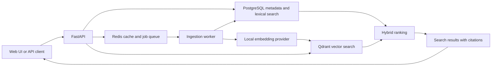

# Enterprise Knowledge Search

Enterprise Knowledge Search is a document retrieval and question-answering service for
technical and operational knowledge. The project focuses on traceable search results,
explicit retrieval behaviour, and local development without paid service credentials.

## Problem

Useful information is often distributed across PDF, Markdown, and text files. Basic keyword
search misses related terminology, while ungrounded generated answers make it difficult to
verify a result. This service is designed to combine lexical and semantic retrieval and return
citations that identify the supporting document section.

## Current status

The current implementation accepts validated PDF, Markdown, and text uploads, rejects duplicate
content, and queues ingestion through Redis. A worker extracts and normalizes content, applies
the configured chunking strategy, generates local embeddings, writes vectors to Qdrant, and
stores citation metadata and lexical-search vectors in PostgreSQL. Document and job status
endpoints expose each lifecycle transition. Retrieval endpoints and the user interface remain
in progress.

## Architecture



PostgreSQL will remain the source of truth. Qdrant will store dense vectors referenced by
stable chunk identifiers. Reciprocal-rank fusion will combine lexical and vector result lists
without treating their raw scores as directly comparable.

## Local setup

Prerequisites:

- Python 3.13
- [uv](https://docs.astral.sh/uv/)
- GNU Make
- Docker or another Testcontainers-compatible runtime

Install dependencies and create local configuration:

```bash
make sync
cp .env.example .env
```

Run all foundation checks:

```bash
make check
```

`make check` includes integration tests that start isolated PostgreSQL and Redis containers.
Use `make test-unit` when a container runtime is unavailable.

Start the API:

```bash
make run
```

Start the ingestion worker in another terminal:

```bash
make worker
```

The interactive API documentation is available at `http://127.0.0.1:8000/docs`.

Apply migrations to the PostgreSQL instance configured by `EKS_DATABASE_URL`:

```bash
make migrate
make migration-check
```

## Example requests

Liveness:

```bash
curl http://127.0.0.1:8000/health/live
```

Expected response:

```json
{"status":"ok"}
```

Readiness:

```bash
curl http://127.0.0.1:8000/health/ready
```

Expected response:

```json
{
  "status": "ready",
  "checks": {
    "database": true,
    "queue": true,
    "vector_index": true
  }
}
```

Upload a Markdown document:

```bash
curl --request POST \
  --url http://127.0.0.1:8000/api/v1/documents \
  --form 'document=@docs/requirements.md;type=text/markdown'
```

The API returns `202 Accepted` with the queued document and ingestion-job identifiers:

```json
{
  "document": {
    "id": "927de0ef-4454-4742-91d5-d8d46d5b604a",
    "original_filename": "requirements.md",
    "media_type": "text/markdown",
    "size_bytes": 3186,
    "status": "queued",
    "failure_code": null,
    "created_at": "2026-07-30T16:00:00Z",
    "updated_at": "2026-07-30T16:00:00Z"
  },
  "ingestion_job": {
    "id": "30cf997a-9818-449b-bf72-d745fc62252e",
    "document_id": "927de0ef-4454-4742-91d5-d8d46d5b604a",
    "status": "queued",
    "attempt_count": 0,
    "failure_code": null,
    "created_at": "2026-07-30T16:00:00Z",
    "updated_at": "2026-07-30T16:00:00Z",
    "started_at": null,
    "finished_at": null
  }
}
```

## Technology and design decisions

- FastAPI and Pydantic provide typed HTTP and configuration boundaries.
- PostgreSQL will provide transactional metadata storage and full-text retrieval.
- Qdrant will provide dense-vector retrieval.
- Redis will support background ingestion and revision-aware caching.
- Answer generation will be optional and disabled by default.
- The web interface will use server-rendered HTML and small local JavaScript modules.

The detailed design is in [docs/architecture.md](docs/architecture.md), with trade-offs in
[docs/design-decisions.md](docs/design-decisions.md).

## Limitations

The application does not yet expose retrieval or deletion endpoints. It supports text-based
PDFs only, uses an English-focused local embedding model, stores uploaded files locally, and
operates as a single workspace without authentication. A failure while initially dispatching a
job is retained for diagnosis but currently requires operator intervention to requeue.

## Roadmap

The short project roadmap is maintained in [ROADMAP.md](ROADMAP.md). Work proceeds through
ingestion, retrieval, grounded answers, interface development, evaluation, and operational
verification.

## Licence

Licensed under the Apache License 2.0. See [LICENSE](LICENSE).
