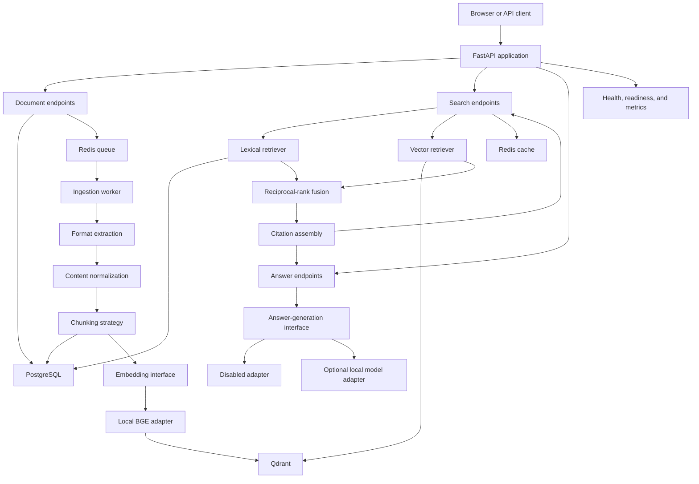
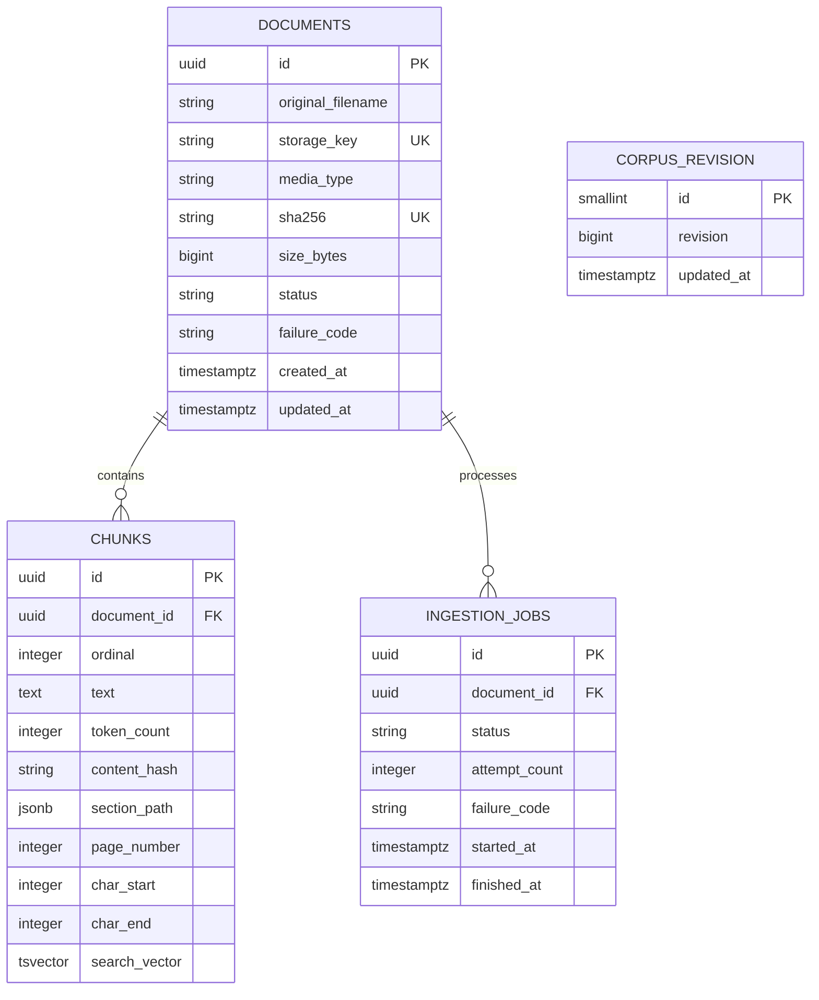

# Architecture

## Context

The service accepts internal reference documents and makes their contents searchable through
keyword, vector, and hybrid retrieval. Search remains useful when answer generation is
disabled. Generated answers, when enabled, must be grounded in retrieved chunks and expose the
same citations as the underlying search results.

## Components

## Module boundaries

- `ingestion` owns extraction, normalization, chunking, and indexing orchestration.
- `retrieval` owns lexical and vector candidate retrieval, fusion, filtering, and citations.
- `generation` owns the optional conversion of retrieved evidence into a grounded answer.
- `persistence` owns relational mappings, migrations, and PostgreSQL repositories.
- `providers` contains concrete adapters for file storage, embeddings, Qdrant, Redis, and the
  optional local model service.
- `api` validates HTTP input and translates domain failures into problem-detail responses.
- `observability` configures structured logs, request correlation, and metrics.

Interfaces are introduced only for external systems or independently testable strategies.
Domain services remain concrete.

## Persisted domain model

Document and job state transitions are enforced in the domain layer and supported by database
constraints. Chunk identifiers are derived from document identity, ordinal, and content hash,
so indexing retries address the same relational and vector records.

## Document ingestion flow

1. The API streams an allowed upload to a generated local path while computing SHA-256.
2. PostgreSQL records the immutable document identity and a queued ingestion job.
3. The worker receives document and job identifiers through a JSON queue payload.
4. A format-specific extractor returns normalized sections with source locators.
5. The configured chunker produces deterministic chunk identifiers.
6. The embedding adapter creates dense vectors and upserts them into Qdrant.
7. PostgreSQL stores chunk text, locators, and generated full-text search vectors.
8. The worker marks the document ready and increments the corpus revision.

Failures record a safe code without logging document contents. RQ retries processing failures,
and the worker converts a failed domain job back through the queued state before starting the
next attempt. Repeated delivery of an already successful job exits without changing the corpus
revision.

## Retrieval flow

1. The API validates the query, mode, result limit, and filters.
2. The lexical retriever queries PostgreSQL full-text indexes.
3. The vector retriever embeds the query and searches Qdrant.
4. Hybrid mode fuses both ranked candidate lists using reciprocal-rank fusion.
5. Results are hydrated from PostgreSQL; records not belonging to ready documents are ignored.
6. Citation assembly returns document name, section path, page, chunk identifier, and excerpt.
7. The response is cached using the corpus revision and retrieval configuration.

## Consistency model

PostgreSQL is authoritative, while Qdrant is a derived index. There is no distributed
transaction between them. A document becomes searchable only after relational chunks and
vectors have been written successfully. Stable chunk identifiers, explicit document states,
and a reconciliation command make partial failures recoverable.

Deletion first marks a document unavailable to queries. Vector deletion and stored-file
cleanup can then be retried without exposing partially deleted content.

## Deployment model

The local Compose environment will contain:

- API process
- ingestion worker
- PostgreSQL
- Qdrant
- Redis
- optional local model service under a separate profile

The API and worker use the same application image but different commands. Persistent volumes
hold database, vector, model, and uploaded-file data.

## Security boundary

The first release is a local single-workspace system. Upload limits, type validation, generated
storage paths, safe error responses, and content-free operational logs reduce accidental
exposure. Authentication, per-user authorization, malware scanning, and untrusted public
deployment remain outside the first release and are documented limitations.
